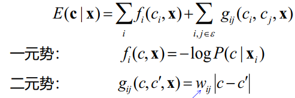

ISO：控制传感器对入射光的敏感性，ISO增高，噪声也会增大。

光圈：控制进光量和景深，越小景深越深

数字图像的表示$f(x,y)$在$1\sim L = 2^{k}$之间，k常为8

空域图像增强

灰度变换：

1.  反色：$s = 1 - r$

2.  幂函数：$s = r^{\gamma}$ 大于1变亮

3.  分段线性变换

直方图处理（自动确定变换函数）

1.  直方图均衡将输入的变量转化为0\~1均匀分布的输出

$$s = (L - 1)\int_{0}^{r}{p_{r}(w)\text{dw}}$$

> 将$p_{r}(r)$曲线下的面积均匀划分为K份
>
> 离散时$s_{k} = (L - 1)\sum_{j = 0}^{k}{p_{r}\left( r_{j} \right)}$
>
> 离散不保证输出为均匀分布

2.  直方图匹配

> 使输出图像的直方图与指定的直方图$p_{z}(z)$一致
>
> 输入直方图均衡：$s = T(r)$
>
> 指定直方图均衡：$s = G(z)$

$$z = G^{- 1}\left( T(r) \right)$$

3.  局部直方图均衡

> 对于每个像素，在邻域内进行直方图处理。
>
> 加速：分块进行（会带来块效应）

空域滤波

平滑滤波器：

1.  均值滤波：

> 高斯：$h(x,y) = \frac{1}{2\pi\sigma^{2}}e^{- \frac{x^{2} + y^{2}}{2\sigma^{2}}}$
>
> 复杂度$n^{2}\text{MN}$
>
> 可分离复杂度$2nMN$
>
> 积分图加速均值滤波

2.  双边滤波：不会磨平边缘

> 空间距离相关的高斯函数与灰度距离相关的高斯函数相乘

锐化：原信号减二阶导

傅里叶变换

一维：

周期冲激函数的傅里叶变换$S(\mu) = \frac{1}{\Delta T}\sum_{n = - \infty}^{\infty}{\delta\left( \mu - \frac{n}{\Delta T} \right)}$

采样后：$\widetilde{F} = \frac{1}{\Delta T}\sum_{n = - \infty}^{\infty}{F\left( \mu - \frac{n}{\Delta T} \right)}$

DFT：$F(u) = \sum_{x = 0}^{M - 1}{f(x)e^{- j2\pi ux\text{/}M}}$

DFT频域范围：$T = M\Delta T,\Delta u = \frac{1}{T},\Omega = M\Delta u = \frac{1}{\Delta T}$

二维：

$$F(\mu,v) = \int_{- \infty}^{\infty}{\int_{- \infty}^{\infty}{f(t,z)e^{- j2\pi(\mu t + vz)}}}\text{dtdz}$$

DFT：
$F(\mu,v) = \sum_{x = 0}^{M - 1}{\int_{y = 0}^{N - 1}{f\left( \text{xy} \right)e^{- j2\pi\left( \text{ux}\text{/}M + vy\text{/}N \right)}}}\text{dtdz}$

平移：$f\left( x - x_{0},y - y_{0} \right) \Leftrightarrow F(u,v)e^{- j2\pi\left( x_{0}u\text{/}M + y_{0}v\text{/}N \right)}$

$$F\left( u - u_{0},v - v_{0} \right) \Leftrightarrow f(x,y)e^{- j2\pi\left( u_{0}x\text{/}M + v_{0}y\text{/}N \right)}$$

旋转：$f\left( r,\theta + \theta_{0} \right) \Leftrightarrow F\left( \omega,\varphi + \theta_{0} \right)$

具有周期性，对称性

实函数-共轭对称

实偶-实偶

实奇-虚奇

居中显示：计算$f(x,y)( - 1)^{x + y}$的DFT。

频域图像增强

频域滤波步骤

1.  对图像补零扩充

2.  计算傅里叶变换，频谱居中

3.  用滤波器进行滤波

4.  频谱移位，计算傅里叶反变换

5.  取出左上角的子图像

实际中的常见做法：在频域设计滤波器，用小尺寸的空域滤波

器近似，提高速度。

图像平滑：

1.  理想低通，$D(u,v) > D_{0} = 0$其余为1

2.  n阶巴特沃斯

$$H(u,v) = \frac{1}{1 + \left\lbrack D(u,v)\text{/}D_{0} \right\rbrack^{2n}}$$

3.  高斯$H(u,v) = e^{- D^{2}(u,v)\text{/}2D_{0}^{2}}$

图像锐化

通过弱化低频、强化高频，可实现图像锐化

高通滤波（1-低通滤波器）

拉普拉斯算子：$\nabla^{2}f = \frac{\partial^{2}f}{\partial x^{2}} + \frac{\partial^{2}f}{\partial y^{2}}$

非锐化掩膜：原图减模糊图得掩膜图，掩膜图\*k加到原图上。

k>1时成为高提升滤波。

同态滤波

$f(x,y) = i(x,y)r(x,y)$光源\|反射系数

处理光照不均匀，假设光照变化缓慢，反射系数变化剧烈

$$z(x,y) = \ln i(x,y) + \ln r(x,y)$$

$$Z(u,v)\mathfrak{= F}\left\lbrack \ln i(x,y) \right\rbrack\mathfrak{+ F}\left\lbrack \ln r(x,y) \right\rbrack$$

设计滤波器对高频和低频进行不同处理

选择性滤波

带通：$D_{0}$为频带中心，W为宽度

$$H_{\text{BBPF}}(u,v) = \frac{1}{1 + \left\lbrack \frac{D^{2} - D_{0}^{2}}{\text{DW}} \right\rbrack^{2n}}$$

高斯：$e^{- \left\lbrack \frac{D^{2} - D_{0}^{2}}{\text{DW}} \right\rbrack^{2}}$

陷阱滤波器：由成对的高通滤波器构成，中心关于原点对称

Gabor滤波器

$$h(x,y) = e^{- \frac{x^{2} + y^{2}}{2\sigma^{2}}}e^{- j2\pi fx}$$

为短时加窗傅里叶变换，用于不同方向特征提取，实部偶对称，虚部奇对称。

图像恢复

图像退化模型：退化系统$H$和加性噪声$\eta(x,y)$联合作用到原始图像上，得到退化图像

只考虑噪声

1.  周期性噪声：选择性滤波器

2.  随机噪声：

> 高斯、瑞利、爱尔朗、指数、均匀、脉冲（椒盐）
>
> 去噪：
>
> 均值滤波：
>
> 算数均值：$\widehat{f}(x,y) = \frac{1}{\text{mn}}\sum_{(s,t) \in S_{\text{xy}}}^{}{g(s,t)}$
>
> 几何均值：$\left\lbrack \prod_{(s,t) \in S_{\text{xy}}}^{}{g(s,t)} \right\rbrack^{\frac{1}{\text{mn}}}$
>
> 逆调和均值：$\frac{\sum_{(s,t) \in S_{\text{xy}}}^{}{g(s,t)^{Q + 1}}}{\sum_{(s,t) \in S_{\text{xy}}}^{}{g(s,t)^{Q}}}$
>
> Q=0算数均值；Q>0，去除椒噪声，Q\<0，去除盐噪声。
>
> 排序滤波器：邻域像素值排序
>
> 中值滤波，最大值滤波，最新熬制滤波，中点滤波(1/2最大最小值)，剪切均值(去d/2个最小值，d/2个最大值后求平均)
>
> 自适应均值滤波器：

$$\widehat{f}(x,y) = \left( 1 - \frac{\sigma_{\eta}^{2}}{\sigma_{L}^{2}} \right)g(x,y) + \frac{\sigma_{\eta}^{2}}{\sigma_{L}^{2}}m_{L}$$

> 噪声方差为0、局部方差很大，输出接近g(x,y)，局部方差小，输出接近均值$m_{L}$
>
> 自适应中止滤波：
>
> 先小邻域计算，如果中值在邻域最大最小值之间，则进行中值滤波，否则扩大邻域。
>
> 非局部均值滤波：
>
> 扩大范围，增加相似度作为均值权重。

$w(i,j) = \frac{1}{Z(i)}\exp\left( - \frac{\left| \left| I\left( N_{i} \right) - I\left( N_{j} \right) \right| \right|_{2}^{2}}{h^{2}} \right)$

N-邻域, h-平滑系数, Z-归一化系数

考虑退化函数的图像恢复

从退化图像中噪声较弱的区域$g_{s}(x,y)$进行处理，得到满意的的恢复$\widehat{f_{s}}(x,y)$，退化函数$H_{s}(u,v) = \frac{G_{s}(u,v)}{\widehat{F_{s}}(u,v)}$，对于线性移不变系统，即为全局退化函数。

逆滤波：$\widehat{F}(u,v) = \frac{G(u,v)}{H(u,v)} = F(u,v) + \frac{N(u,v)}{H(u,v)}$

当H小于n时用n代替避免除0

噪声高频多，退化图高频弱，难以恢复，可提高n。

维纳滤波：最小化误差平方的均值

$\widehat{F}(u,v) = \left\lbrack \frac{1}{H(u,v)}\frac{\left| H(u,v) \right|^{2}}{\left| H(u,v) \right|^{2} + S_{\eta}(u,v)\text{/}S_{f}(u,v)} \right\rbrack G(u,v)$

$S_{\eta}(u,v)$为噪声功率谱，$S_{f}(u,v)$为原图功率谱，常未知，两项相除用K代替，尝试不同的K。

彩色图像处理

RGB到HSV：

伪彩色图像处理：灰度到rgb

hsv单分量处理

彩图平滑与锐化：为线性操作，单通道和矢量法结果相同。

白平衡：选白色区域分别计算RGB分量$m_{R\text{/}G\text{/}B}$的平均和平均亮度$m_{l}$，三通道调整，$R^{'} = R\frac{m_{l}}{m_{R}}$

LUT：3DLUT，4个变化值采样压缩，每个格子B相同，R、G分别沿x、y方向增加。

彩图分割：计算需要区域RGB均值，小于某一阈值的视为同色。

图像压缩

1.  编码冗余$\rightarrow$变长编码

2.  空间冗余$\rightarrow$游程编码

3.  不重要信息$\rightarrow$量化...

性能指标：

1.  压缩比$C = b\text{/}b^{'}$

2.  保真度：主观、客观

编码器：映射器（图像变换），量化器（降低精度），符号编码器。

解码：符号解码器+逆映射器

图像信源：像素值为随机变量，信源按某概率模型产生。

信息量$h(x) = \log_{2}\frac{1}{P(x)}$

熵-平均信息量$H(X) = \sum_{x \in A_{X}}^{}{P(x)\log_{2}\frac{1}{P(x)}}$

霍夫曼编码

预测编码

无损：利用相邻值的相关性，求差

有损：

插值存在量化误差，用重构值求误差，避免误差累积。

增量调制（语音编码常用）

在平坦区，量化器的输出符号交替改变；在过载区，输出符号稳定

变换编码（减弱相关性）

傅里叶、余弦、Walsh-Hadamard

对8×8小块进行变换，得到系数，将小于某值的置零，从左上到右下沿对角线组合形成序列编码。

指纹AM-FM表示

脊和端可以用相位建模，相位分解为连续相位和螺旋相位。

平滑图像：保留重要傅里叶变换系数，算术编码

螺旋相位图像：游程编码

形态学处理

腐蚀$\ominus$：和结构元完全重叠

膨胀$\oplus$：有交集，均取结构元中心

开运算$\circ$：腐蚀膨胀，用于去掉细突起，小物体

闭运算$\cdot$：去断开的裂缝。

集中与否$\circledast$：前景图和前景腐蚀结果与背景图与背景腐蚀结果的交集，可查表加速。

形态学算法

边界提取：原图减特定结构元腐蚀

形态学重建：标注图和结构元膨胀，与掩模图相交，迭代n次，用于提取连通分量、删除边界物体、区域填充（反色区域连通分量提取）等

细化算法$\otimes$：$A \otimes B = B - (A \circledast B)$，利用一系列B进行细化直到不变。

修剪：去除细化结果中的毛刺，用细化去除端点，再从结果的端点条件膨胀与原图相交。

灰度形态学

腐蚀：取结构元中最小值

开运算：去亮细节

开闭组合可滤波

形态学梯度：膨胀减腐蚀

高帽：原图减开运算，使光照均匀

粒度测量：形态学处理得到不同尺寸颗粒的分布。

图像分割

一阶导产生较粗的边缘，二阶导在斜坡和台阶处产生双边缘，而且边缘较细，二阶导对细节（细线、孤立点）的响应较强，二阶导的符号能确定细节是亮或者暗

点检测：拉普拉斯变换(点邻域差异)，如果差异超过阈值认为是点

线检测：

1.  可用一串点组成线

2.  特定方向：3×3卷积核，关心方向为2，其余为-1

边缘检测

计算梯度：Prewitt算子，Sobel算子（中心垂线上的两点为2），x、y方向分别计算

高级边缘检测

Marr-Hildreth边缘检测，LoG算子

高斯+二阶导，检测过零点，

$$\nabla^{2}G = \left\lbrack \frac{x^{2} + y^{2} - 2\sigma^{2}}{\sigma^{4}} \right\rbrack e^{- \frac{x^{2} + y^{2}}{2\sigma^{2}}}$$

Canny边缘检测算法

对梯度幅度谱做非极大抑制，若边缘上的点不是梯度方向上的最大值，则置零。双阈值二值化，高于之去除大部分噪声，用低阈值图像补充边缘。

霍夫变换

根据先验知识生成霍夫空间，将边缘点转换到霍夫空间的曲线进行投票，找出峰值，计算边缘。

阈值法

1 选初始阈值T，原图两个区域分别求阈值再平均，直到收敛

2 Ostu：使类间方差最大的阈值

假设k为阈值，$P_{1}(k),P_{2}(k)$为两个类别的概率，两类的均值$m_{i}(k) = \frac{1}{P_{i}(k)}\sum_{i = 0}^{k}{ip_{i}},\, p_{i} = \frac{n_{i}}{\text{MN}},\,$全局均值$m_{G} = \sum_{i = 0}^{L - 1}{ip_{i}}$类间方差$\sigma_{B}^{2} = \sum_{i}^{2}{P_{i}(k)\left( m_{i}(k) - m_{G} \right)^{2}}$

平滑后进行处理可以减小噪声的影响，但无法处理单点图

利用边缘改善阈值法

1 计算边缘图

2 边缘图二值化

3 边缘图灰度直方图求阈值

4 利用该阈值二值化输入图像

分区阈值

基于局部图像属性的阈值

区域增长：

1 找种子点

2 与种子点灰度相近的像素为前景

3 将与种子连通的前景加入种子区域

分水岭

局部最小点注水，两个盆地要合并时修水坝，继续注水直到最高的山顶

灰度形态学重建

$D_{g}^{(1)} = (f \oplus b) \land g,\, \land$为min

重建开：先腐蚀再膨胀形态学重建

$E_{g}^{(1)} = (f \ominus b) \vee g,\ \  \vee ,\,$为max

重建闭：......

K-means聚类：随机K个聚类中心，将每个样本分配到距离最近的聚类中心，更新聚类中心（均值）

SLIC超像素分割

网格采样，得到初始的聚类中心，将中心移动到相邻梯度最低的位置，计算聚类中心周围2S×2S内的每个像素到中心的距离，计算和上一步的残差，判断是否收敛

$$d^{2} = \left( l^{2} + a^{2} + b^{2} \right) + m^{2} \times \frac{x^{2} + y^{2}}{s^{2}}$$

图割法

最小割（能量最小化）：

表示与描述

边界表示

边界跟踪：左上1出发，$c_{0}$表示左近邻，从$c_{0}$顺时针检查$b_{0}$8近邻，第一个1为$b_{1}$，前一个0为$c_{1}$，令$b_{0} = b_{1},c_{0} = c_{1}$继续跟踪，直到两个点都和初始点相同。

链码：8方向表示下一个边界点。

改进：选择使整个链码整数最小的起点作为起点，将方向转为方向的差异，不同采样间隔下的链码（大间隔的链码更短、对噪声不敏感）

签名：从中点做各个角度的射线，记录距离。选有特征的点作为起点，将距离缩放到0\~1之间，使其具有不变性

边界的简单描述子

边界长度：链码中竖直和水平方向数+对角方向数的$\sqrt{2}$倍

直径：距离最远两点的距离

主轴：距离最远两点的连线

次轴：垂直于主轴

基本矩形：长宽沿着主轴和次轴的方向：将边界包含在内的最小矩形

曲率：反应方向变化

傅里叶描述子：转化为复坐标系，做离散傅里叶变换

将边界转化为一维函数后可以用矩来描述边界：

$\mu_{n}(x) = \sum_{x = a}^{b}\left( f(x) - m \right)^{n}$

$\mu_{n}(x) = \sum_{i = 0}^{k - 1}{\left( x_{i} - m \right)^{n}p\left( x_{i} \right)}$

形状上下文：非常冗余

区域描述

面积、周长、紧致度（周长的平方/面积）、圆度闭（区域面积/等周长圆面积）

拓扑描述子：洞数、连通成分数、欧拉数（连通成分数-洞数）

CPMC分割中短轴最有用

纹理描述子：

灰度直方图，平滑度$R(z) = 1 - \frac{1}{1 + \mu_{2}\text{/}(L - 1)^{2}}$

均匀度$U(z) = \sum_{i = 0}^{L - 1}{p^{2}\left( z_{i} \right)}$

熵$e(z) = - \sum_{i = 0}^{L - 1}{p\left( z_{i} \right)\log_{2}p\left( z_{i} \right)}$

灰度共生矩阵：行列为量化后的灰度值，值为满足相对位置Q的元素对个数

归一化灰度共生矩阵描述子：

相关系数$\sum_{i = 1}^{K}{\sum_{j = 1}^{K}\frac{\left( i - m_{r} \right)\left( j - m_{c} \right)p_{\text{ij}}}{\sigma_{r}\sigma_{c}}}$

对比度：$\sum_{i = 1}^{K}{\sum_{j = 1}^{K}{(i - j)^{2}p_{\text{ij}}}}$

齐次性：$\sum_{i = 1}^{K}{\sum_{j = 1}^{K}\frac{p_{\text{ij}}}{1 + |i - j|}}$

SIFT：关键点周围统计梯度方向直方图

谱方法：极坐标行是

峰值点的角度反应了纹理主要成分的方向

峰值点到原点的距离反应纹理主要成分的周期

以上难以表示较大尺度的特征

texton特征图

基于主成分的描述

协方差矩阵：$\mathbf{C}_{\mathbf{X}} = E\text{\{}\left( \mathbf{x} - \mathbf{m}_{\mathbf{x}} \right)\left( \mathbf{x} - \mathbf{m}_{\mathbf{x}} \right)^{T}\text{\}}$,$\mathbf{m}_{\mathbf{x}}$为均值向量

协方差矩阵对角化，特征值从大到小排列，

$$\mathbf{y = A}\left( \mathbf{x -}\mathbf{m}_{\mathbf{x}} \right)$$

$$\mathbf{x =}\mathbf{A}^{\mathbf{T}}\mathbf{y +}\mathbf{m}_{\mathbf{x}}$$

用$\mathbf{A}^{\mathbf{T}}$前k个特征向量重建x近似。

图像配准

基本空间变换，增广向量$\lbrack x,y,1\rbrack^{T}$

平移：最后一列平移的距离

旋转：$\cos\theta\, - \sin\theta;\,\sin\theta\,\cos\theta$

缩放：前两个列为缩放的值

仿射：线性变换加平移（最后一行001）

射影变换

利用空间变换结果按照最小均方差求解变换参数

弹性变换：分片仿射、全局TPS（薄板样条）

推广霍夫变换：遍历所有对应点组合，寻找最优变换参数

RANSAC：SURF特征随机取点，判断是否符合模型，更新关键点。

弹性图像配准

初配准+双分辨率配准（采样网络内进行相似性匹配）
