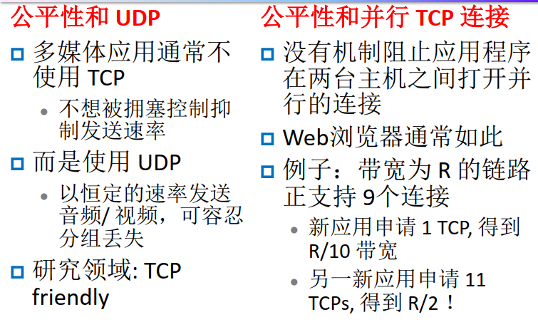
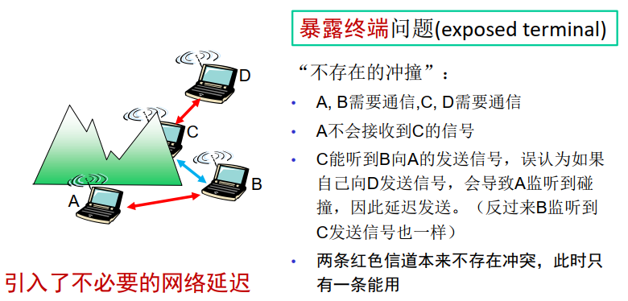

## 绪论

互联网三要素：设备、协议、服务

K表示$10^3$，Ki表示$2^{10}$

### 什么是因特网

数以百万计的互联计算设备：主机或端系统（运行网络应用程序），通信链路（传输率为带宽），分组交换设备（交换机、路由器）

协议，因特网（“网络之网络”），因特网标准

因特网通过通信基础设施允许分布式应用程序运行

### 网络边缘

服务器和端系统都在网络边缘

C/S：信息不对等；P2P对等

TCP：可靠的、保序的基于字节流的数据传送，需要通过握手设置两个通信主机之间的“状态”（同步）

UDP：无连接，不可靠

网络性能指标：

- RTT：往返时间
- Propagation：传播时延=Distance/Speed of Light
- Transmission：传输时延=(Size/Bandwidth)\*\#Hops
- Queue：排队时延=5~10 Transmission
- Latency=Propagation + Transmission + Queue

带宽时延积（delay\*bandwidth)链路上的最大比特数

接入网：端系统连接到其边缘路由器的物理链路

边缘路由器是端系统到任何其他远程端系统路径上的第一台路由器

网络接入类型

- 住宅接入

  数字用户线（DSL）：使用现有电话线，下行会冲突

  ADSL：非对称的，下行比上行需求量大

  混合光纤同轴电缆：下行不冲突上行会冲突

- 公司接入：局域网（LAN）

- 无线接入

物理介质

- 导引型媒体：光纤、双绞铜线、同轴电缆
- 非导引型媒体：无线局域网、数字卫星频道

### 网络核心

1. 电路交换

   为每次“呼叫”预留端到端资源，网络元被分割为若干“片“，频分、时分

   网络的复杂度只在建立连接时体现

2. 分组交换

   资源竞争

   1. 存储转发时延：路由器等待整个分组数据块完全到达，才能把它转发下一段链路，传输L位的分组到带宽为Rbps的链路上需要L/R秒，若只有一个分组，中间有Q-1个服务器，数据量为L，带宽为R，则总时延为QL/R s

   2. 排队时延

      在一段时间内如果输入链路的到达率（比特）超过输出链路的传输率：

      - 分组将排队，等待被传输到链路上
      - 如果内存（缓存）已满，分组将被丢弃（丢失）

   在突发的数据传送情况下表现优秀

   - 资源共享

   - 不用建立呼叫

   可能导致过分的拥塞: 导致分组时延和丢失

   - 需要确保可靠数据传送和拥塞控制的协议

### ISP和因特网主干

网络结构1：用单一的全球传输ISP互联所有的接入ISP

网络结构2：多个全球ISP彼此互联

网络结构3：一个区域也可能有多个竞争的ISP

网络结构4：在网络结构3上增加存在点（PoP）、多宿、对等和因特网交换点

网络结构5：在网络4顶部增加了内容提供商网络，描述了现今的因特网

### 分组交换网络中的时延

处理时延$d_{proc}$，微秒或更低

排队时延$d_{queue}$，毫秒或微秒量级

传输时延$d_{trans}$，毫秒或微秒量级

传播时延$d_{prop}$，毫秒量级

排队时延：

- R = 传输速率
- L = 分组长度
- a = 平均分组到达率
- 流量强度traffic intensity = La/R，La/R$\to$1限制流入的网络流量—拥塞控制

丢包

端到端时延

假设源主机和目的主机之间有N-1太路由器且无拥塞$d_{end-end} = N(d_{proc} + d_{trans} + d_{prop})$

有拥塞排队时延会盖过其他时延

吞吐量：每个连接的端到端吞吐量：$\min(R_c, R_s, R/10)$，分别为源主机带宽、目的主机带宽和网络核心带宽

### 协议层次及服务模型

1. 复杂性

   - 有许多“组件”
   - 拓扑结构的复杂性
   - 网络服务的复杂性

2. 因特网的设计原则

   - 最简单与自治
   - 尽量递送
   - 无状态路由选择
   - 分散控制

3. 体系结构

   分层的网络系统：每一层实现一种服务，分层协作，各司其职

   因特网协议栈：应用层、运输层、网络层、数据链路层、物理层

### 网络安全

## 应用层

### 应用层协议原理

运行在端系统上

1. 网络应用程序体系接哦古

   1. C/S架构

      服务器：总是开机；固定、周知的IP地址；可创建虚拟服务器

      客户机：与服务器通信；可能间歇连接；可以拥有动态IP；不可与其他客户机通信

   2. P2P架构

      不存在总开机的服务器；任意端系统之间可以直接通信；每个点都是断断续续上网并不断改变IP地址；每个点都从其他点请求服务同时也为其他点提供服务

   3. C/S和P2P混合架构

2. 进程通信

   实际通信时进程而不是程序，交换报文

   1. 套接字Sockets

      Socket = IP地址+端口号

   2. 应用层协议

      所交换的报文类型、格式、予以、规则，有公开协议和专有协议

3. 可供应用程序使用的运输服务

   不同程序需求不同

   可靠的数据传递、定时、吞吐量、安全性

   运输层协议：TCP、UDP

### Web和Http

Web的应用层协议是超文本传输协议(HyperText Transfer Protocol, HTTP)[RFC1945, RFC2616]，定义报文的格式、客户机和服务器如何进行报文交换

Web页面: 一个基本HTML文件+引用对象

1. HTTP概况

   - Web浏览器实现路HTTP的客户机端
   - 每个对象通过一个URL来寻址
   - 运输层采用TCP协议
   - 无状态协议
   - C/S架构

2. 非持续性连接和持续性连接

   非持续性连接：每个请求/响应对经单独的TCP连接发送

   持续性连接：所有请求/响应对经相同的TCP连接发送

   1. 非持续性连接

      1. 响应时间

         RTT：一个短分组从客户到服务器然后再返回客户所花费的时间。

         总响应时间 = 2RTT + 文件传输时间

         发起TCP连接+请求文件+文件传输

   2. 持久连接

      1. 不带流水线
         - 仅当前一个响应已被接收以后， client才能发出新的请求
         - 每个被引用对象都需要一个RTT
      2. 带流水线
         - Client只要遇到一个被引用对象，就可以立刻发送请求
         - 最好的情况下得到所有的被引用对象只需要一个RTT

3. HTTP请求报文

   请求行：方法字段、URL字段、HTTP协议版本字段

   首部行

   实体主体

   用表单生成的请求不一定使用POST方法，可以使用扩展的URL，GET

   HEAD，服务器响应HTTP报文，但不返回请求对象。可用于调试跟踪。

   PUT，向Web服务器上传对象。

   DELETE，删除Web服务器上的对象。

4. HTTP响应报文

   状态行：协议版本、状态码、响应状态信息

   首部行

   实体主体

5. 用户与服务器的交互：cookie

   - HTTP响应报文中有一个cookie首部行
   - HTTP请求报文中有一个cookie首部行
   - 在用户端系统中保留有一个cookie文件，由用户的浏览器管理
   - Web站点有一个后端数据库

   没有cookie时响应报文会包括Set-cookie项

   有cookie时，请求报文会包括cookie项

6. Web缓存器

   定义： 能够代表初始Web服务器来满足HTTP请求的网络实体

   用户设置浏览器，所有HTTP请求首先指向Web缓存器

   如果cache中有所需的对象： cache返回对象

   否则cache从原始的服务器请求该对象，然后把该对象发送回client

   总时延 = Internet时延 + 接入时延 + LAN时延

   缓存可以降低总时延

   对于请求率/更新率$\gg$1的文档可以缓存

### 文件传输协议：FTP

C/S架构，21号端口传输控制信号，20号端口传输数据（带外传输），Server需维护“状态”：当前目录、早先授权

### 电子邮件Email

三个主要组成部分

- 用户代理：与自己的服务器传输数据
- 邮件服务器
- 简单邮件传输协议：SMTP

1. 邮件服务器

   邮箱：包含各个用户的已接收的邮件报文

   待发邮件报文的报文队列message queue

2. SMTP协议

   25端口，TCP协议

   报文主体和首部均为7比特ASCII码格式

   直接传递：两个服务器直连

3. 邮件报文格式和MIME

   首部行包含环境信息：From、To、Subject

   非ASCII码数据的MIME扩展

4. 接收的报文

   SMTP接收服务器一旦接收到具有RFC 822和MIME首部行的报文，就在该报文的顶部添加一个Received:首部行

5. 邮件访问协议

   从服务器提取邮件信息

   POP3：特许阶段+处理阶段+更新阶段

   IMAP：允许客户在文件目录中组织整理邮件报文

   HTTP：更加通用

### 域名系统DNS

主机名到IP地址的翻译

由具有分层体系结构的许多名字服务器 name servers 构成的分布式数据库 distributed database

应用层协议

不采用集中式DNS：单点故障、通信容量、时延、维护、缺乏可扩展性

分布式、层次化数据库：根DNS服务器，顶级域（TLD）DNS服务器、权威DNS服务器

1. 根DNS服务器

   本地DNS服务器当发现有无法解析的名字时与之联系根DNS服务器

2. 顶级域DNS服务器和权威DNS服务器

   顶级域DNS服务器Top-level domain (TLD) servers:

   - 负责 com, org, net, edu, gov 等和所有顶级国家域 cn, uk, fr, ca, jp

   权威DNS服务器

   - 一般是组织机构自己的 DNS 服务器，给该组织机构的服务器提供权威的从主机名到 IP 地址的映射 (如 Web和 mail)

3. 本地DNS服务器

   把查询转发DNS层次体系中

4. DNS名字解析

   递归查询（与本地DNS服务器）+迭代查询（本地DNS服务器与其他DNS服务器）

5. DNS：记录的缓存和更新

   一旦(任何)名字服务器 学习到了新的名字映射，它就把这个新的映射内容作一个缓存caching

   - 经过一段时间后(TTL)缓存的内容会超时(消失)
   - 本地名字服务器通常缓存有TLD服务器的信息

   缓存的数据项可能会过期

6. DNS记录

   (Name, Value, Type, TTL)

   Type = A：主机名到IP地址

   Type = NS：域名到该域权威DNS服务器的主机名

   Type = CNAME：别名到规范名

   Type = MX：别名到邮件服务器规范主机名

7. DNS协议和报文

   DNS协议：问询 query 报文和回答 reply 报文具有相同的报文格式 message format

   

8. 把记录添加到DNS

   需要给注册机构提供你的基本和辅助权威DNS服务器的名字和IP

9. DNS与安全性

   - DNS中间人攻击：截获主机请求，并返回伪造的回答
   
   - DNS毒害攻击：向DNS服务器发送伪造应答(responses)，诱使其改变缓存记录
     - 钓鱼网站：金融诈骗，获取银行卡号密码
   - 蛮力攻击 DDoS： denial of service attacks on the root servers
     - 发送ICMP Ping报文。被过滤器过滤掉
     - 发送DNS请求。不易被过滤，但一般都缓存了常用域名地址

### P2P应用

1. P2P文件分发：P2P体系结构的扩展性

    从一个服务器到N个对等方分发一个大小为F的文件要花多少时间?

    $u_s$：服务器接入链路的上传速率

    $d_i$：第i个对等方接入链路的下载速率

    $u_i$：第i个对等方接入链路的上传速率

    C/S架构：需要发送N份拷贝，分发时间$D_{c-s} \geq \max \left\{N F / u_{s},, F / d_{\min }\right\}$

    P2P架构：$D_{P 2 P} \geq \max \left\{F / u_{s}, F / d_{\min }, N F /\left(u_{s}+\sum_{i=1}^{N} u_{i}\right)\right\}$
    
2. BitTorrent

    参与一个特定文件分发的所有对等方的集合称为一个洪流(torrent)。洪流中的对等方彼此下载等长度的文件块。下载完整文件后，可能离开或继续上传。

    所请求的块应发送给哪些邻居？

    - 最稀缺优先，大致均衡每个块在洪流中的副本数量。

    - 响应请求时，采用对换算法，按供给速率确定最高的4个邻居，+1个随机选择的试探对等方。  

    1. 集中式目录索引

       问题：单点故障、版权

    2. 分布式：

       查询洪泛: Gnutella协议（完全分布）

       层次覆盖：利用异质性KaZaA

       - 每个单点要么是一个群组领袖(group leader)，要么被指派给一个群组领袖（超级对等方）
       - 群组领袖单点跟踪其所有组员单点的内容，袖珍型索引

    3. Skype的P2P因特网电话

       成对用户实时相互通信

       索引将用户名映射到IP地址（和端口号），通过超级节点提供查询。

    4. 中继节点

       当Alice和Bob都位于“Nat”后面时的问题

       - 利用 Alice和Bob的超级节点, 选择中继
       - 每个单点发起和中继的会话

### 视频流和内容分发网（CDN）

分布式，应用层协议和基础设施

1. DASH：Dynamic, Adaptive Streaming over HTTP，经HTTP的动态适应性流

   server：

   - 将视频切分为许多视频段数据块
   - 每个块以不同的比特率存储和编码
   - 告示文件: 为每个版本提供一个URL及其编码
   
   client：
   
   - 定期测量接收带宽
   - 请求告示文件，一次选择一个块
     - 根据当前带宽选择最大比特率
     - 在不同时间可以选择不同的比特率（取决于该时刻的可用带宽）
   
   “intelligence” at client: client determines：
   
   - 何时请求块 (不会发生寄存器为空或溢出)
   - 请求何种比特率 (有更大可用带宽时请求更大比特率)
   - 去何处请求块 (最近的服务器或有最高可用带宽的服务器)
   
2. 内容分发网

   难点: 如何将流式内容（从大量视频中选取）分发给大量同时请求的用户？

   方案1：建立单一的大规模数据中心

   - 单点故障
   - 网络拥塞
   - 部分用户原理数据中心
   - 相同的数据可能在相同链路上发送多次
   - 没有扩展性

   方案2：在遍布全球的分布式站点存储视频的副本 (CDN)

   - 深入：将CDN服务器集群部署到ISP的接入网中
   - 邀请做客: 通过在少量（例如10个）关键位置建造大集群来邀请ISP做客。

   CDN: 在CDN节点上存储内容备份

   用户向CDN请求内容

   - 指派用户到地理上最为临近的集群
   - 如果网络拥塞，指派到其他集群

### 套接字编程

1. 使用TCP的Socket编程

   Socket: 位于应用程序进程和端到端传输协议(UDP或 TCP)之间的“门户”

   TCP service: 从一个进程到另一个进程的可靠的字节流bytes 传递

   TCP 在 client 和 server之间提供可靠的、保序的字节(“pipe”)传递

   客户机必须联系服务器

   - 服务器打开欢迎之门，客户机敲欢迎之门，服务器开新Socket与客户端传输

2. 使用UDP的Socket编程

   UDP 在client和server之间提供了不可靠的字节组(“datagrams”)的传递

## 传输层

### 传输层服务和协议

网络层： 主机之间的逻辑通信

传输层： 进程之间的逻辑通信

- 依赖于、并增强了网络层服务  

可靠的、保序的递送（TCP）

- 拥塞控制
- 流量控制
- 建立连接

不可靠的、不保序的递送（UDP）

- 尽力而为的IP服务的扩展

不能提供的服务

- 时延保证
- 带宽保证

### 多路复用与分解

发送主机的复用：从多个套接字收集数据，封装上报头信息（为了以后的分解）

接收主机的分解：把接收到的报文段递送到正确的套接字

1. 分解是如何进行的

   主机接收 IP 数据报datagram
   
   - 每个数据报具有源 IP 地址和目的 IP 地址
   - 每个数据报中载有一个传输层报文段 segment
   - 每个报文段有源端口号和目的端口号
   
   主机利用 IP 地址和端口号来引导报文段到达正确的套接字
   
   1. 无连接分解：由二元组决定(dest IP address, dest port number)
   
      源端口号起到提供 “返回地址” 的作用
   
   2. 面向连接的分解：四元组决定

### 无连接的传输：UDP

不用建立连接，更小的报文段开销，简单，无拥塞控制

通常为流媒体应用使用

- 可以忍受一些丢包
- 对传输速率敏感

其他应用

- DNS
- SNMP

UDP校验和

### 可靠数据传输原理

1. rdt2.0：具有比特差错信道上的可靠数据传输

   - 差错检验
   - 接收方反馈
   - 重传

   

2. rdt2.1:处理被损坏的 ACK/NAKs

   rdt2.1＝rdt2.0+Seq#在2.0的基础上加上数据包的序号

   发送方：

   

   接收方：

   

3. rdt2.2: 不需要NAK 的协议

   接收方靠发送上一个成功接收的分组的ACK来实现同样的目的, 而不是发 NAK

   - 接收方必须明确地指明被肯定确认的分组的顺序号： ACK中包含顺序号

   发送方收到冗余的ACK 以后将采取和收到NAK 一样的行动：重传当前分组

   

4. rdt3.0: 在有位差和数据丢失信道上的可靠数据传输

   发送方在一个“合理”长的时间内等待 ACK，Rdt3.0＝Rdt2.2 + Timeout

   

   问题：RTT时间较长，停-等操作导致信道利用率降低

5. 流水线协议

   流水线 Pipelining: 发送方允许发送出多个 “in-flight”,还没有得到确认的分组

   - 顺序号的范围必须扩大了
   - 在发送方和/或接收方要建立缓存区
   
   1. GBN协议
   
      发送方最多可以有N个未确认的分组在流水线中
   
      接收方仅发送累计确认cumulative acks
   
      - 只有当所有序号n之前的分组已经正确接收，才发送n序号分组的ACK
      
      发送方为最早的未确认分组设定计时器
      
      - 一旦定时器超时， 重传所有的未确认分组
      
      一个定时器
      
      
      
      receiver 只需简单地
      
      总是发送目前为止收到的完整序号分组的最大序号ACK
      
      对于乱序到达的分组的处理：丢弃，不缓存
      
   2. 选择性重传（SR协议）
   
      发送方最多可以有N个未确认的分组在流水线中
   
      接收方确认每一个单独的分组
   
      发送方为每个未确认分组维持一个计时器
   
      - 当计时器超时，仅重传未确认分组
   
      多个定时器
   
      发送方:
   
      上层调用发数据
   
      - 如果滑动窗口中有可用序号，则发送
   
      分组n超时 timeout(n):
   
      - 重发分组n，并重启其定时器
   
      分组n确认 ACK(n) in [sendbase,sendbase+N]: 
   
      - 将分组n标识为已确认
   
      - 如果n是最小的未确认分组序号 将基序号推进至下一最小未确 认分组序号
   
      接收方：
   
      收到序号n的分组 pkt n in [rcvbase, rcvbase+N-1]
   
      - 发送分组n确认 send ACK(n)
   
      - 乱序out-of-order: 缓存 buffer
   
      - 按序 in-order: 组装数据传给上层应用，且将窗口基序号推进至下一未接收分组序号
   
      收到序号n的分组 pkt n in [rcvbase-N,rcvbase-1]
   
      - 发送分组n的确认 ACK(n)
   
      否则
   
      - 忽略
   
      窗口大小选取：
   
      windowsize <=½ seq #’s

### 面向连接的传输：TCP

1. 报文结构

   
   
2. TCP序号和确认号

   序号 Seq（己方字节流编号）

   - 报文段数据首字节的字节流编号

   确认号 ACK（对方字节流编号）

   - 希望从对方收到的下一个字节的序号
   - 提供累积确认cumulative ACK

   问题: 接受方如何处理失序报文段？

   - TCP没有规定
   - 由实现者自己决定
     - 缓存或丢弃
   
3. 如何选择合适的超时时间

   Time Interval > RTT

   如何确定RTT？

   - 动态更新
   - 通过 EWMA (Exponential weighted moving average,指数加权滑动平均，属于“时间序列回归分析”领域知识) 用新探测到的RTT来更新旧RTT

   EstimatedRTT=(1-$\alpha$)$\cdot$EstimatedRTT＋$\alpha \cdot$SampleRTT

   跟踪RTT偏差量

   DevRTT = (1-$\alpha$)$\cdot$DevRTT+$\alpha\cdot$| SampleRTT-EstimatedRTT |  

   TimeoutInterval = EstimatedRTT＋4·DevRTT

4. TCP可靠数据传输

   TCP 在 IP 的不可靠的服务之上创建可靠数据传输服务

   流水线方式传送报文段

   累积确认

   TCP 使用单重传定时器

   重传由下列事件触发

   - 超时事件 timeout events
   - 冗余确认 duplicated acks
     - 三次冗余确认，视为发生了丢包
   
5. TCP的一些修改

   1. 加倍超时时间

      如果定时器超时，则将TimeoutInterval乘2

   2. 快速重传

      三次冗余确认

      Duplicated ACKs 意味着有分组丢失，于是在定时器超时之前重传

      为什么? 超时间隔可能太长

   TCP组合了GBN和SR

6. TCP流量控制

   避免因发送方传输太快太多而使接收方的缓存溢出

   接收方: 明确地通知发送方（动态变化的）空闲缓存空间的数量

   - TCP 报文段中的 RcvWindow 域

   发送方: 保持已发送的但未被确认的数据量在最近接收到的 RcvWindow 值以内

   - 保证接收缓存不溢出
     LastByteSent-LastByteAcked<=RcvWindow

7. TCP连接管理

   TCP发送方、接收方在交换报文段之前要建立“连接”

   初始化TCP变量

   - 序号
   - 缓存、流量控制信息(例如 RcvWindow)
   
   三次握手
   
   
   
   关闭连接
   
   

### 拥塞控制原理

场景2：优先缓存，发送方重传分组

场景3

拥塞控制的方法：端到端拥塞控制、网络辅助的拥塞控制

### TCP拥塞控制

端到端控制

传输速率由拥塞窗口大小Congwin所限制

LastByteSent-LastByteAcked<=min{Congwin,RcvWin}  

w个报文，每个具有MSS字节，在一个RTT中发送$throughput = \frac{w*MSS}{RTT} Bytes/sec$

1. 试探机制

   加性增：每收到一个ACK时，增加1/Congwin个报文段数等价于每个RTT时间内，增加1个报文段数（线性增加）

   乘性减：检测到一个丢包时，将Congwin值减半（指数降低）

2. 慢启动机制

   指数增加窗口尺寸

   - 每过一个RTT时间，窗口尺寸倍增

   当CongWin大于Threshold时，进入拥塞避免阶段

3. 拥塞避免机制

   TCP Tahoe 无论收到三个冗余 ACK还是超时，都回到慢启动阶段

   TCP Reno 收到三个冗余 ACK 后，窗口减半，进入拥塞避免阶段，取消慢启动阶段 (快速恢复 fast recovery)

   快速恢复时，每次收到冗余的ACK后， congwin+1，三次冗余确认congwin总共+3（膨胀），因而途中的拥塞避免阶段从9开始，而不是6，若收到新的Ack则减取3，去膨胀

   当发生三次冗余确认 triple duplicate ACK 时, 把Threshold 设为 CongWin/2 并把 CongWin 设为Threshold+3

   当发生超时 timeout 时, 把 Threshold 设为CongWin/2 并把 CongWin 设为 1 MSS

   超过x时丢包代表在x时刻丢包

4. TCP吞吐量的宏观描述

   忽略超时事件后出现的慢启动阶段并假设一直有数据需要发送， 在一个特定的往返间隔内， TCP发送数据的速率是拥塞窗口w与当前RTT的函数。

   W：一个丢包时间发生时的串口长度

   平均吞吐量=0.75*W/RTT bytes/sec

5. TCP公平性

   

   最终会分享相同带宽

   

## 网络层：数据平面

### 概述

1. 网络层功能

   - 转发:路由器将分组从一个输入链路接口转移到适当的输出链路接口
   - 路由选择:确定分组从源到目的地的路径
     - 路由算法
   
2. 数据平面

   - 网络层中每台路由器的功能
   - 决定到达路由器输入链路的数据报如何转发到该路由器的适当输出链路
   - 转发功能
   
3. 控制平面
   - 网络范围的逻辑
   
   - 控制数据报沿着从源主机到目的主机的端到端路径中路由器之间的路由方式

   - 两种控制方法
   
     - 传统路由算法：在路由器中实现
     
       在一台路由器中的路由选择算法与在其他路由器中的路由选择算法通信，以计算出它的转发表的值。
     
     - 软件定义网络：在远端服务器中实现
     
       远程控制器计算和分发转发表以供每台路由器使用，路由选择设备仅执行转发

### 路由器工作原理

路由器的两个主要功能

- 运行选路算法/协议 (RIP, OSPF, BGP)
- 把数据报从输入链路转发到输出链路

1. 输入端口功能

    1. 分散式转发

        - 给定分组目的地，用输入端口内存中的转发表查找输出端口
        - 目标: 以“线路速度”完成输入端口处理，即单次查找时间<单分组接收时间
        - 阻塞与排队: 假如分组的到达快于转发到交换结构的速率

    2. 两种转发模式

        - 基于目的地转发： 仅基于目的地IP地址转发（本节只考虑这种情况）
        - 通用转发： 基于任一首部字段值转发

    3. 最大前缀匹配

        查找给定目标地址的转发表条目时，如果有多个匹配，在转发表中寻找最长的匹配项，并向与最长前缀匹配相关联的链路接口转发分组

2. 交换结构

    1. 分组由系统 CPU复制，由计算机充当路由器功能，速度受内存带宽的限制
    2. 分组经过共享的总线从输入端口内存到输出端口内存，无需选路处理器干预，总线竞争bus contention: 交换速度受限于总线带宽
    3. 经一个互联网络交换：

       - 克服了总线带宽的限制
       - 纵横式网络和其它互联网络,过去在多处理机中用来连接多个处理器
       - 先进设计趋势: 把长度变化的IP分组分片成固定长度的信元(cell)，加上标签，通过互联网络进行交换
    
3. 何时出现排队

    1. 输入端口

       - 交换结构工作速度慢于输入端口组合起来的速度
       - 线路前部阻塞 head-of-the-line (HOL) blocking: 排在队列最前面的分组挡住了队列中的其它分组向前移动
       - 排队时延以及丢包源于输入缓存溢出

    2. 输出端口

       - 当来自于交换机构的分组快于输出链路的速率时要缓存
       - 调度规则 从排队的分组中选择待传输的分组：先来先服务FCFS，加权公平排队WFQ，随机早期检测RED...
       - 交换结构速率： 交换结构能够从输入端口到输出端口移动分组的速率
       - 假设交换结构速率>输入、输出线路速率xn
       - 最坏情况下输入端口不排队，但输出端口会排队
       - 当经由交换结构的到达速率超过输出线速时开始缓存
       - 排队时延以及丢包源于输出端口缓存溢出

       RFC3439：平均缓存量=平均RTT*链路容量C

       最近推荐：当N个TCP流经时，缓存还需除$\sqrt{N}$
    
4. 排队与调度

    1. FIFO先进先出

    2. 优先权排队

       Priority queue:发送最高优先级的排队数据包

    3. 加权公平排队

       WFQ(Weighted Fair Queuing)：

       - 以循环的方式为各个类提供服务
       - 从每个类发送一个完整的数据包（如果可用）

### 网际协议——IPv4，寻址，IPv6及其他

网络层三大组件：IP协议，选路协议，ICMP协议（互联网控制报文协议）

1. 网络层协议IP-因特网中的转发和编址

   IP数据报格式

   

   IP分片和重组

   网络链路层有最大传输单元MTU限制 (max. transm. unit) – 最大可能的链路层帧能承载的数据量

   - 不同的链路类型，不同的MTUs

   大的IP数据报在网络中被划分为小“片”

   - 一个数据报变为几个数据报
   - 仅在最终目的地“重新组装”
   - IP 报头位用来对相关的片进行识别、排序
   
   因特网MTU为1500Byte，计算时需要减20，总数据量中包括IP首部的20字节+有效载荷，偏移量需要除以8
   
   分片会增加网络负载
   
2. IPv4编址

   IP地址与接口相关，而不是主机或路由器

   网络地址/子网地址：IP+子网掩码/前缀长度

   将每个接口切一刀，隔离了几个网络孤岛就有几个子网

3. IP编址：分类编址（传统方法）

   ABC类网络

   低利用率，不灵活

4. 无类别域间选路：CIDR

   IP地址的网络部分可用任意长

5. 怎样获得一个IP地址

   1. 主机部分
   
       手工分配，配置静态IP地址
       DHCP: 动态主机配置协议: 动态地获得地址, 指定IP地址、子网掩码、 网关、 DNS、IP租期等

       - 即插即用

       DHCP：动态主机配置协议

       - 主机广播”DHCP discover”报文
       - DHCP服务器用”DHCP offer”报文响应
       - 主机请求IP地址: ”DHCP request” 报文
       - DHCP服务器发送地址: ”DHCP ack”报文

       DHCP不仅仅可以返回子网内主机分配的IP地址：

       - 第一跳路由器地址（默认网关）
       - DNS服务器的地址
       - IP地址网络掩码
       
   2. 网络部分
   
       从ISP的地址空间里得到被分配的部分
   
6. 层次化编址：路由聚合

   层次化编址允许高效率地向外通告(advertise)选路信息

   一个子网需要移动到另一个ISP下时，只需要将其网络地址加入路由器即可，最长前缀匹配的方法使得不会出现混淆

7. 特殊IP地址

   网络号或主机号全为”0”
   
   - 意味着“当前”， ”this”, “default”, or “current”
   - 特定的某个网络 - Host Bits all “0” 154.3.0.0
   - 当前网络的某特定主机 - Network Bits all “0” 0.0.99.6
   - 当前主机 - “Me” 0.0.0.0
   
   网络号或主机号全为”1”
   
   - 意味着“所有” ,”all”
   - 特定网络的所有主机 - Host Bits all “1” 154.3.255.255
   - 广播到当前网络的所有主机 - all “1” 255.255.255.255
   
   其他保留地址
   
   - 本地主机测试地址 Loopback address： 127.0.0.1
   - 其他保留地址：用来未来实验或管理因特网时内部使用
   33
   私有地址： 10.x.x.x, 172.16.x.x～172.31.x.x, 192.168.x.x
   
8. NAT网络地址翻译

   所有离开本地网络的数据报都有相同的NAT IP地址，但有不同的源端口号

   基本思想: 本地网络只使用一个IP地址和外部世界相连接

   - 不需要从ISP获得IP地址范围：所有本地计算机对外只用一个IP地址
   - 可以在本地（内部）网络内随便改变IP地址，不必通知外部世界
   - 可以改换ISP，而不必修改本地网络内的地址
   - 位于内网的计算机不能被外部世界直接寻址，不可见(增加了安全性)
   
   关于NAT的争议
   
   - 端口号应用于编址进程，而非编址主机
   - 路由器只应该处理到第3层，不应涉及运输层
   - 违反了end-to-end 约定
      - 中间节点不应介入修改IP地址和端口
      - NAT 可能性必须被应用开发者考虑, 例如 P2P 应用
   - IP地址短缺的问题应该由IPv6来解决
   
   无有效IP地址，外界无法直接访问，无法充当服务器， …
   
9. IPv6

   IPv6报头

   Priority 优先级(8bits) 区别数据流中的数据报优先级

   Flow Label 流标签(20bits) 区别在同一”流”中的数据报,用于QoS 管理 (“流”的概念尚未明确定义)

   Next header 下一个报头(8bits): 表明数据的上一层协议，等同IPv4中的协议字段

   没有分片机制： 加快路由器处理速度

   Checksum: 完全去掉了，无需做检验和运算，缩短在每一跳的处理时间

   Options: 允许，但在报头部分之外, 由 “NextHeader” 域表明，保证40字节的报头定长

10. 从IPv4 到 IPv6

   隧道： IPv4路由器中IPv6数据包作为IPv4数据包的负载

### 通用转发和SDN

每个“分组交换机”包含一个由远程控制器计算和分发的流表

OpenFlow数据平面抽象

流表：匹配加动作转发表在OpenFlow中称为流表

通用转发：简单的包处理规则

- Pattern： 匹配数据包首部字段中的值
- Actions： 当分组匹配流表项时，丢弃、转发、修改或将匹配的数据包发送给控制器
- Priority： 消除重叠匹配的歧义
- Counters（计数器）：已经与该表项匹配的分组数量，该表项上次更新以来的时间

## 网络层：控制平面

### 路由选择算法

1. 链路选择算法

   所有节点通过链路状态广播(LS broadcast) 得到关于网络拓扑结构和链路费用等相同的信息（链路状态信息）

   Dijkstra 算法是链路状态选路算法的基本理论，例如OSPF（开放最短路优先）

   LS选路算法的问题Oscillations or huntingphenomenon振荡现象

   所有的路径不同时（异步）运行LS算法，存在自同步现象，因此允许引入随机时延

2. 距离向量选路算法

   所有节点和与它之间相连的节点交换距离向量信息(DV)，更新自己的距离向量，然后再把更新后的距离向量反馈给相邻节点

   ✓  分布式 Distributed: 每个节点接受来自直接相邻节点的距离向量信息，迭代更新之后再把结果反馈回相邻节点
   ✓ 迭代的 Iterative: 相邻节点的距离向量信息交换和距离向量更新持续进行，直到没有更多的信息可交换
   ✓ 异步的 Asynchronous: 不要求所有节点按时钟同步操作
   ✓ 自终止的 Self-terminated: 没有要求停止的信号，但节点经过一定时间后自行停止

   Bellman-Ford方程（动态规划中的最优性原理）

   $d_x(y) = \min\{c(x,v) + d_v(y)\}$

   核心思想:
   
   - 每个节点不时向其邻居发送自己的距离向量
   - 当节点x收到一个其邻居的新的距离向量时,使用B-F 方程更新自己的距离向量
   
   如果需要，可周期性探测并更新
   
   好消息（费用减少）传播迅速
   
   坏消息传播慢：出现选路环路
   
   增加毒性逆转(毒性返路) Poisoned reverse:
   
   - 如果Z通过Y选路到达目的地X :
   - Z 告诉Y 其(Z’s) 到X的距离为无穷大 (这样Y将不会再通过Z选路到X，从而避免选路环路)
   
   能完全解决无穷计数问题吗?
   
   - 涉及到三个以上节点形成的循环路由将无法用毒性逆转技术探测到
   
3. 比较DV和LS

   

### 因特网中自治系统内部的路由

1. 层次选路

   把路由器聚合成多个区域, “autonomous systems”(AS)自治系统

   在同一AS中的路由器运行同样的选路协议“intra-AS”

   网关路由器

   - AS 中的特殊路由器
   - 与AS中所有其他路由器之间运行 intra-AS 选路协议
   - 同时 负责到AS以外目的地的选路
   
   转发表同时由 intra- 和 inter-AS 选路算法来配置
   
   - Intra-AS 为内部目的节点设置表项
   - Inter-AS & Intra-AS 为外部目的节点设置表项
   
   inter-AS选路任务
   
   1. 学习哪些目的地址经由AS2可达，哪些经由AS3可达？
   2. 将该可达信息传递给AS1域内的所有路由器
   
   Intra-AS Routing protocol
   
   - 又叫做内部网关协议 Interior Gateway Protocols(IGP)
   - 最常用的IGP
      - RIP: Routing Information Protocol 选路信息协议 (RFC 1058，2453)
      - OSPF: Open Shortest Path First 开放最短路径优先 (RFC 2328)
      - IGRP: Interior Gateway Routing Protocol 内部网关选路协议(Cisco 专有）
   
   Inter-AS Routing protocol
   
   - 最常用的
      - BGP4: Border Gateway Protocol 边界网关协议 (RFC 1771, 1772, 1773)
   
   OSPF开放最短路优先
   
   - 开放：路由选择协议规范是公众可用的
   - 使用链路状态路由选择算法
      - 链路状态包转发
      - 整个自治系统的完整拓扑图
      - 基于Dijkstra算法的路径计算
   - 路由器将“OSPF链路状态通告”洪泛到整个自治系统中所有其他路由器
      - OSPF通告包含在OSPF报文中，该OSPF报文直接由IP承载（而不是TCP或UDP）
      - 链接状态：对于每个相连的链路
   - IS-IS路由协议：与OSPF几乎相同
   
   OSPF“高级”功能
   
   - 安全性: 所有的 OSPF 报文要经过验证 (防止恶意入侵)
   - 允许多条相同费用路径 (RIP中仅允许一条)
      - 可适当进行分流和负载平衡
   - 集成的单播和多播支持:
      - Multicast OSPF (MOSPF) 使用与 OSPF 相同的拓扑结构数据库
   - 在大的网络域中支持层次化的 Hierarchical OSPF
   
   Hierarchical OSPF
   
   - 两层体系结构: local area, backbone.
     - 仅在当地区域中通告链路状态
     - 每个节点有详细的当地区域的拓扑结构信息; 但仅知道去在其他区域中的网络的大致方向 (shortest path)
   - 区域边界路由器 Area border routers: “汇总” 到自己区域内各网络的距离, 通告到其他Area Border routers.
   - 主干路由器 Backbone routers: 仅在主干网上运行 OSPF 选路
   - 边界路由器 Boundary routers: 连接到其他AS

### ISP之间的路由选择：BGP

BGP(边界网关协议):自治系统间路由选择协议

- “把互联网粘在一起的胶水”

BGP为每个AS提供了一种方法：

- eBGP:从相邻ASes获取子网可达性信息
- iBGP:给As内部的所有路由器传播可达信息
- 基于可达性信息和策略确定到其他网络的“好”路由

允许每个子网向因特网的其余部分通告它的存在：“我在这里”

BGP会话：两个BGP路由器（“对等方”）通过半永久性TCP连接交换BGP报文：

- 通告到达不同特定CIDR前缀子网或子网集合的路径， BGP是一种“路径向量”协议

网关路由器同时运行eBGP和iBGP协议

1. 路径属性和BGP路由

   通告前缀中包括一些BGP属性

   - 前缀+属性=“路由”

   两个重要的属性：

   - AS-PATH:包含了通告前缀时已经通过的AS的列表
   - NEXT-HOP:AS-PATH起始的路由器接口的IP地址

   基于策略的路由：

   - 当网关路由器接收到路由通告时，使用import policy 来决定接收/拒绝该通告。
   - AS策略还决定是否向其他相邻的AS们通告路由。
   
2. BGP报文

   BGP 使用 TCP 交换报文（半永久TCP连接）

   BGP 报文

   - OPEN: 打开到对等节点的 TCP 连接，并对发送者进行验证
   - UPDATE: 广告新的路径 (或撤销旧的)
   - KEEPALIVE 在收到 UPDATES 报文时保持当前连接可用; 同时对 OPEN 请求进行确认
   - NOTIFICATION: 报告先前报文中的错误; 也被用来关闭连接
   
3. BGP路由选择

   路由器可能学习到到达目的AS的多个路由，路由选择基于：

   - 本地偏好属性：值是一种策略决定
   - 最短AS-PATH
   - 最近NEXT-HOP路由器：热土豆路由选择（选择开销最小的本地网关）
   - 附加标识符
   
4. Intra-AS 和 Inter-AS 的对比
   策略

   - Intra-AS: 简单的管理, 不需要策略上的决策
   - Inter-AS: 网管希望控制网络中的数据流量是如何选择外部路径的，以及哪些外部网络流量可以选路经过它的网络

   规模

   - 层次化选路节省路由表空间, 减少更新信息的流量

   性能

   - Intra-AS: 集中在性能上（最短路径费用）
   - Inter-AS: 对策略的考虑比性能更重要（业务规则）

### SDN控制平面

网络管理更容易：避免路由器配置错误；更大的流量调度灵活性

基于流表的转发（调用OpenFlow API）允许“编程”路由器

- 集中“编程”更容易：集中计算流表，并分发
- 分布式“编程”更困难：在每个路由器中实现分布式算法（协议）后计算流表

控制平面的开放实现（非单一厂商专有）

1. SDN体系结构

   1. 数据平面交换机

      - 硬件方面，使用快速、简单的分组交换机实现通用的数据平面转发
      - 分组交换机的流表由控制器集中计算、分发
      - 用于基于流表的分组交换机控制的API（例如OpenFlow）
        - 定义哪些是可控制的，哪些不是
      - 与控制器通信的协议（例如OpenFlow）
   2. SDN控制器

      - 维护网络状态信息
      - 通过北向接口与上方网络控制应用程序交互
      - 通过南向接口与下方受控网络设备通信
      - 使用分布式系统实现，以提高性能、可扩展性、容错性和健壮性
   3. 网络控制应用程序

      - SDN控制平面的“大脑”：使用了由SDN控制器提供的API来定义和控制网络设备中的数据平面
      - 数据平面交换机、 SDN控制器和网络控制应用程序是分离的实体，该实体可以由不同的厂商和组织机构所提供

2. SDN控制器的组件

   

3. OpenFlow协议

   在SDN控制器、交换机之间运行

   OpenFlow协议运行在TCP之上

   - 可选是否加密

   三类OpenFlow报文:

   - 控制器到受控交换机
   - 异步 (受控交换机到控制器)
   - 双向对称的消息 (杂项)
   
   控制器到交换机的重要报文：读状态、配置、修改状态、发送分组
   
   交换机到控制器的重要报文：流删除、端口状态、分组入（将分组发送给控制器）
   
4. OpenDaylight（ODL）控制器、ONOS控制器

### ICMP：因特网控制报文协议

主机、路由器和网关相互之间进行网络层信息通信

- 错误报告: unreachable host, network, port, protocol
- 回声响应/回答 (used by ping)

network-layer “above” IP:

- ICMP 报文被承载在IP数据报中

ICMP 报文: type, code 加上产生错误的 IP 数据报的*前8个字节*

Traceroute与ICMP

### 网络管理和SNMP

1. 网络管理框架

   被管设备上运行的网络管理代理与管理服务器进行通信

   

2. SNMP协议

   传递MIB协议的两种方法、命令：

   1. 管理服务器请求，被管设备响应
   2. 被管设备发送陷阱报文

## 链路层和局域网

### 链路层概述

- 主机和路由器都称为节点nodes
- 通信链路上与节点毗邻的通信信道称为链路 links
- 链路层的数据分组称为帧frame, 它把数据报datagram 封装起来

数据链路层：负责把数据报从一个节点经过一条链路传递到相邻的另一个节点

链路层服务

- 成帧

  - 把数据报封装成帧,加上报头header和报尾trailer(帧格式)
- 链路访问 link access

  - 当多个节点共享媒介时, 负责信道的访问控制(多种方法)
  - 帧的报头中使用“MAC” 地址以识别源节点和目的节点
- 相邻节点之间的可靠数据传输 reliable delivery

  - 在低位差链路上很少使用 (如光纤链路, 某些双绞线链路)
  - 无线链路经常使用(确认&重传机制): 高差错率
  - 若只有上层可靠数据传输，效率太低，若只有下层，存储等地方也可能出错
- 流量控制 flow control
  - 有限缓存，在相邻的发送和接收节点交换信息、调节发送速率
  - 与运输层的流量控制不重复
- 差错检测 error detection
  - 信号衰减、电磁干扰噪声等导致比特(位)差错
  - 接收节点检测差错，并通知发送节点重传或丢弃帧
  - 在链路层非常普及，比传输层更复杂，通过硬件实现(快速)
- 差错纠正 error correction
  - 接收节点不仅能检测而且能够纠正比特差错 , 不必重传(编码方法)
- 半双工 half-duplex 和 全双工 full-duplex
  - 半双工传输时，链路两端的节点不能同时传输和接收
  - 现有链路大多是全双工模式

### 差错检测和纠正技术

1. 奇偶校验

   - 一位奇偶校验
     - 只能检测单bit错误或者说奇数（偶校验时）个错误
   - 二维就校验
     - 能偶检测并纠正单个比特错误
     - 或检测2个bit错误，但不能纠正

2. 互联网校验和

   发送方：

   - 把报文段的内容看成是16位整数的序列
   - 检验和: 把报文段的内容相加 ，并按位取反
   - 发送方把检验和的值放入 checksum 域
   
   接收方：
   
   - 计算收到的报文段所有字段的和，包括检验和
   - 检查算出的检验和是否为全1
     - NO – 检测出差错
     - YES – 未检测出差错，但仍然可能存在差错
   
   提供较弱的差错保护，软件实现
   
3. 循环冗余检测CRC

   把要发送的数据比特, D, 看作一个二进制数

   双方协商一个 r+1 位的模式 (生成多项式 generator), G

   目的: 选择 r 位的CRC, R, 使得

   - <D,R> 恰好被 G 整除 (模2算术)
   - 接收方也知道 G, 用 G 去除 <D,R> ；若余数不为零: 检测到差错！
   - 能检查到所有小于 r+1 位的突发误差
   - 长度大于r+1比特的错误以概率$1-0.5^r$被检测到
   
   在实践中广泛使用 (以太网, 802.11 WiFi, ATM)
   
   $R = remainder[\frac{D\cdot 2^r}{G}]$模2算数，不进位

### 多路访问链路和协议

1. 随机访问协议

   当节点有分组要发送时

   - 以信道的全部数据率 R 发送
   - 事先不和其他节点协调

   两个或两个以上的节点同时发送 ➜ “碰撞”

   随机访问 MAC 协议 规定

   - 如何检测碰撞
   - 如何从碰撞中恢复 (e.g., 等待一段时间后重传)
   
   1. 时隙ALOHA
   
      假设：
   
      - 每帧都一样长
      - 把时间分成大小相等的时隙（等于发送一帧的时间）
      - 节点仅在时隙的开始时刻发送帧
      - 各节点是同步的，每个节点直到时隙何时开始
      - 如果在某个时刻发生两个或多个帧的碰撞，所有节点在本时隙阶数之前都能检测到碰撞
   
      操作：
   
      - 当节点从发送缓存中得到新的一帧，则在下一个时隙发送
        - 如果没有发生碰撞，则节点成功发送该帧
        - 如果有碰撞，则节点以概率p在随后的每个时隙内重发该帧直到成功发送
   
      优缺点：
   
      - 优点
        - 允许单个活动的节点以信道的全部带宽 R bps发送帧
        - 分布式、简单
      - 缺点
        - 活动节点多了以后, 碰撞的机会增加, 效率损失
        - 有时隙闲置，带宽资源浪费
        - 节点能在比发送帧更短的时间内检测到碰撞，资源浪费
        - 需要时钟同步
      
      效率：
      
      假设每个节点在每个时隙都以概率p发送一帧，一个时隙内任意节点发送成功的概率为$Np(1 - p)^{N - 1}$，当$p^*=1/N$时，达到最大效率$1/e$
      
   2. 纯ALOHA
   
      - 不分时隙，不需同步
      - 当一帧到达后立刻发送
      - 冲突后以概率p重传
      - 大量用户时最佳效率$1/(2e)$
   
      效率：类似时隙ALOHA可得$Np(1 - p)^{2(N - 1)}$
   
   3. 载波侦听多路访问CSMA
   
      在发送前先侦听信道(检测电平)
      
      - 如果信道空闲，则发送整个帧
      - 如果检测到信道忙，推迟发送
      
      碰撞仍然可能发生：
      
      传播时延(propagation delay)使得两个节点不能听到对方的发送
      
   4. CSMA/CD
   
      载波侦听和推迟机制和 CSMA 一样，额外增加了碰撞检测（collision detection）
   
      - 在短时间内检测到碰撞(不必等传完整个帧)
      - 取消发生碰撞的帧发送，以减少信道的浪费
      
      碰撞检测
      
      - 在有线局域网中容易实现: 测量电平强度，比较发送信号和接收信号
      - 在无线局域网中难以实现: 信号随距离衰减
         - 节点自身发送信号强度远强于监听到的其他节点信号强度，信号淹没
         - 即使本地有信号重叠，也不一定会影响其他节点处接收信号
      
      以太网CSMA/CD的基本原理
      
      - 不分时隙slots
      - 如果网卡(adapter)侦听到某个网卡正在传送，则不发送 ——载波侦听carrier sense
      - 正在传送数据的网卡如果检测到其他网卡也在传送，则放弃当前传
        送 —— 碰撞检测collision detection
      - 在尝试重传之前, 网卡等待一个随机的时间 ——随机访问 random access
      
      具体协议
      
      - 网卡(adapter)从网络层接收数据报，封装成帧
      - 如果网卡真听到信道空闲（96bit time内无传送），则开始传送帧；如果侦听到信道忙，则等待直到信道空闲，然后传送
      - 如果传送过程中网卡检测到有其他传送存在，则放弃，并发送48bit的阻塞信号jam signal，确保其他发送者都意识到碰撞
      - 放弃传送后，进入指数后退 exponential backoff 阶段：在第n次碰撞后，网卡从$\{0, 1, 2, \dots, 2^m - 1\},\ m=\min(n, 10)$中随机选择一个K；等待$K\cdot 512\mathrm{bit}$的时间，再进入侦听状态
      
      效率：
      
      $t_{prop}$=局域网中任意两个节点的最大传输延迟
      
      $t_{trans}$=传输最大长度的以太网帧所需的时间
      
      近似得$efficiency=\frac{1}{1 + 5t_{prop}/t_{trans}}$
      
      若希望效率逼近100%：
      
      - 需要$t_{prop}$趋近于0（一碰撞就终止，不会浪费时间）
      - 或者$t_{trans}$趋近于无穷大（一直占据信道）
      
      问题：高负载时效率低
      
   5. “Taking Turns”MAC协议
   
      

### 交换局域网

48位的MAC 地址 (LAN 地址/物理地址)

- 用来把帧从一个网络接口传递到另一个物理上相连的网络接口 (同一个网络内--即网络地址相同)

1. ARP：地址解析协议

   LAN 中的每个 IP 节点 (主机、路由器) 都有一张ARP 表

   ARP表：同一个LAN内节点的IP与MAC地址之间的映射<IP address; MAC address; TTL>

   1. 目标节点在同一LAN

      

   2. 目的节点在不同LAN(子网)

      路由器 R 有两张 ARP 表, 每个 IP 网络 (LAN) 一张

      在源主机的网络层配置中(DHCP)，查到其网关路由器 111.111.111.110

      在源主机的 ARP 表中, 查到路由器 MAC 地址 E6-E9-00-17-BB-4B

      A 创建带有源地址 A、目的地址 B 的数据报

      A根据B的IP地址和子网掩码，得知B不在同一子网内，从而A准备将该帧递送给其网关路由器111.111.111.110 (R的接口1)

      A 使用 ARP 得到 R 的接口1 (111.111.111.110) 的 MAC 地址

      A 创建以 R 的接口1的 MAC 地址为目的地址的链路层帧，其中封装了A-to-B IP 数据报

      A 的网卡发送帧

      R 的接口1的网卡收到帧

      R 从以太网帧中提取出 IP 数据报, 看出来它是要发往 B 的, 并通过其转发表查出来该IP数据报应该由其接口2 (222.222.222.220) 转发, 并由B的IP地址和子网掩码推断出B与接口2在同一子网内

      R 使用其接口2的 ARP 得到 B 的 MAC 地址

      R 的接口2 创建帧，其中包含有 A-to-B IP 数据报，发送到 B

2. 以太网

   以太网物理结构：总线（所有节点在同一个“碰撞域”）；星型拓扑结构（节点之间数据不会碰撞）

   1. 以太网帧结构
      - 导言 Preamble
        - 一共8个字节: 前7 个字节都是 10101010, 最后一个字节是 10101011
        - 用来同步发送网卡和接收网卡的时钟速率SFD(Start Frame Delimiter)
      - Addresses: 目的MAC地址和源MAC地址，各6 个字节
      - Type: 2字节，指明更高一层的网络协议IP/IPX/Apple Talk
      - Data: 46~1500 字节 (Why?-back later)
      - CRC: 4字节，由接收方进行检测, 如果检测到差错, 则简单地将帧丢弃
      
      以太网帧最小长度：避免由于传输过快无法检测出碰撞
      
      发送最小帧所需的时间 >= 链路的最大往返时延 
      
   2. 802.3 以太网标准: 链路层与物理层
   
      许多 不同的以太网标准构成
      
      - 通用的 MAC 协议和以太网帧格式
      - 不同的传输速率: 2 Mbps, 10 Mbps, 100 Mbps, 1Gbps, 10 Gbps, 40 Gbps
      - 不同的物理层媒介: 光纤，铜缆等
      
      
      
      10BaseT和100BaseT
      
      - 10/100 Mbps 速率; 后者也称为 “快速以太网”
      - “T” 代表双绞线 Twisted Pair
      - 节点都连接到一个集线器 hub: “星型拓扑”; 节点到 hub 最大距离100 米
   
3. 链路层交换机

   集线器Hub：物理层设备

   - 将信号放大并中继，无任何控制
   - 现已基本被交换机淘汰（同样便宜且功能更强大）
   - 拓扑结构
     - 物理上: 星型；逻辑上: 总线型
   
   双绞线和RJ45接口
   
   曼彻斯特编码
   
   - 1：高电平→低电平； 0：低电平→高电平
   - 以太网使用基带传输，无需载波调制(ADSL)
      - 适配器直接给广播信道发送基带数字信号，低频谱/短距离/大带宽
   - 在 10BaseT 中使用(更高速率网络中编码方式不同)
   - 每一位有一个跳变(便于提取同步信号)
   - 允许发送节点和接收节点的时钟彼此同步
      - 不需要一个集中的、关于所有节点的全局时钟
   
   用主干集线器 Backbone Hub 组网
   
   - 通过主干 hub 把几个 LAN 网段互联
   - 优点：增加了连通性，扩展了节点之间的最大传输距离
   - 缺点：原先各自网段的碰撞域合并成一个更大的碰撞域
   
   交换机
   
   - 链路层设备
     - 通常存储转发 store-and-forward 帧 (与路由器对比..)
     - 检查帧的头部并根据MAC目的地址选择性地转发帧 (交换机表)
     - 同一网段内的帧采用 CSMA/CD 来共享访问信道 
   - 透明 transparent
     - 主机没有意识到交换机的存在
   - 即插即用 plug-and-play, 自学习 self-learning
     - 交换机不需要预先配置，自学习交换机表
   - 具有多个输入输出端口的高性能Hub， 隔离碰撞域，避免了广播风暴
     - N Shared Hub user on R link: R/N
     - N users on switch: R
   
   交换机: 独享访问
   
   多段口交换机，每条链路都独立应用以太网协议，全双工，每条链路具有独立的碰撞域（隔离碰撞域，消除广播风暴）
   
   转发表：类似路由表(MAC Address, Interface, Time Stamp)
   
   自学习：
   
   交换机学习哪个主机可以经过哪个接口而抵达
   
   - 当收到帧时，交换机记录发送者的位置: incoming LAN segment
   - 在转发表中记录下”发送者/位置”对
   
   若表项未知，*广播转发*
   
   若已知，则选择性转发
   
   交换机: 网络流量的隔离
   
   - 安装交换机以后，把子网分成了几个LAN 网段
   - 交换机对分组进行过滤:
      - 同一网段的帧通常不被转发到其他的网段
      - 每个网段成为一个单独的冲突域 collision domains
   
   更多：
   
   直接转发 cut-through switching: 直接把帧从输入端口向输出端口转发，不必等收到整个完整的帧
   
   - 可以略微减少时延
   - 对比存储转发store-and-forward
   
   可以是共享(段交换)/独享(端口交换)以及10/100/1000 Mbps 多种接口的混合组网
   
   交换机与路由器
   
   - 都是存储转发 store-and-forward 设备
      - 路由器: 网络层设备 (检查网络层的数据报头)
      - 交换机: 链路层设备 (检查链路层的帧头)，效率更高
   - 路由器负责维护路由表, 实现选路算法
   - 交换机负责维护交换表, 实现过滤和自学习算法
   - 路由器组网规模更大
      - 路由器：千量级主机数；交换机：百量级
   
4. 虚拟局域网VLAN

   按交换机端口进行分组

   可用实现：流量隔离、成员动态调整

   在VLAN之间转发：通过路由实现（像是通过不同交换机）

   trunk端口（VLAN干线连接端口/汇聚端口）：

   - 用于在不同物理交换机之间传输多个VLAN的数据包。
   - 跨物理交换机之间传输的802.1q数据包必须携带VLAN ID标签
   - 802.1q协议规定了在不同物理交换机的trunk端口之间传输时，怎样添加/删除VLAN ID标签
   
   802.1Q协议的VLAN帧格式
   
   

### 链路虚拟化：网络作为链路层

多协议变迁交换（MPLS）

- 动机: 利用简短的定长标签实现高速IP数据转发，改善网络速度(instead of IP address)

  - 利用固定长度表示实现快速查找(而非最长前缀匹配)
  - 借鉴综合了虚电路（Virtual Circuit）的相关技术
  - 依然基于IP寻址和路由选择

支持MPLS的路由

- 也叫标签转发路由（label-switched router）
- 仅根据标签确定转发端口(而不检查IP 报头内部)
   - MPLS 转发表与 IP转发表不同
- 灵活性: MPLS 转发决策可以与IP协议不同
   - 可以将源地址不同、目的地相同的IP数据路由到不同的路径中去，而不是单一的最小费用路由(流量工程)
   - 链路断连的情况下快速恢复、重新选路:预先计算了备用链路 (对于VoIP等延迟敏感的多媒体业务很有用)

MPLS vs IP

- IP routing: 前往目的IP地址的路线仅仅由目的地址单独决定
- MPLS routing: 前往目的地的路径由源IP和目的IP共同决定
   - 快速链路恢复: 预先计算好备用路由线路

MPLS 消息 signaling

- 利用改良的 OSPF, IS-IS 链路状态洪泛协议传播MPLS路由信息
- MPLS 接入路由采用 RSVP-TE 消息协议来决定下行路由的转发路径

### 数据中心网络

在大型数据中心，成千上万的服务器被密集的堆放在一起

负载均衡器:基于应用路由

1. 等级体系结构： 提供了良好的扩展性

   当需要增加服务器和机架时，可以直接横向扩容

   较好的将数据中心扩展到几十万台主机的规模

   问题：主机到主机的容量受限

2. 全拓扑连接：大幅提升的连通性与可靠性
   每台第一层交换机都与所有第二层交换机相连，提供了多重路径
   
   - 增加了机架之间的带宽
   - 利用冗余连接提升了服务可靠性

## 无线与移动网络

两大特点: 无线/移动，两大模式: 基础设施/自组织

### 无线链路的特性

衰减；多径；干扰

1. 无线链路的特性

    SNR: signal-to-noise ratio 信噪比

    - SNR越大 – 越容易从噪声中提取信号

    BER: bit-error-rate 误码率

    SNR v.s. BER tradeoffs

    - 给定物理层模式 (编码和调制) : 增加发射功率 -> 增加SNR -> 降低BER
    - 给定 SNR: 选择合适的物理层协议，如编码和调制方式，以满足BER要求，最大化吞吐率
    - SNR 将随移动性变化: 动态调整编码调制方式(Adaptive Modulation Coding, AMC技术广泛运用) 
    
2. 经典问题

    1. 隐藏终端问题：1. 障碍物阻挡，2. 信号衰减
    
       
    
    2. 暴露终端问题
    
       
    
3. 码分多路访问（CDMA）

    - 在集中无线广播信道(蜂窝cellular, 卫星等)标准中使用
    - 给每个用户分配一个唯一的 “编码” ; i.e., 编码集划分code set partitioning
       - 所有用户共享相同的频率, 但每个用户有自己的码片序列“chipping” sequence (i.e., code) 来编码数据
       - 允许多个用户共存 并且以最小的干扰同时发送 (如果编码是正交的“orthogonal”)
    - encoded signal = (original data) X (chipping sequence)
    - 解码 decoding: 编码信号和码片序列的内积

    CDMA具有一定的加密和抗干扰能力

### IEEE 802.11无线局域网（“WiFi”）

1. WLAN体系结构

    - 无线主机与基站通信 base station = access point (AP)
    - 基础设施模式中的基本服务集Basic Service Set (BSS) (即 “cell”)包括:
       - 无线主机
       - 接入点 access point (AP): 基站
       - ad hoc 模式: 仅无线主机
    
2. 802.11：信道，关联

    802.11b: 2.4GHz-2.485GHz 频率范围被划分成11个不同频率的信道

    - AP admin chooses frequency for AP
    - 可能有干扰: 信道可能与相邻AP所选择的信道相同!

    主机: 必须与一个AP 关联associate
    
    被动扫描：从AP发送信标帧
    
    主动扫描：自主机广播探测请求帧
    
3. MAC协议：CSMA/CA（碰撞避免）

    发送方：

    1. 如果侦听到信道空闲了DIFS时间，则开始发送数据帧（无CD碰撞检测）
    2. 如果侦听到信道忙，则开始计时器，且值为$[0, CW-1]$间随机回退值，初始CW = CWmin = 32 slots，如果信道空闲，则计时器递减，否则冻结
       当计时器为零时，开始发送数据帧。如果未收到ACK, 倍增CW并重复步骤2 (直至CW≤CWmax=$32*2^5$, 或某个指定值)如果收到ACK, CW=CWmin, 重复步骤2传输下一帧

    接收方：

    return ACK after SIFS

    和CSMA/CD的区别联系

    - 相同点
       - 载波侦听多路访问 CSMA
    - 不同点
       - CA: 碰撞避免，没有碰撞检测
       - 检测到信道空闲，并不立即发数据
       - 等待一随机时间，且该时间随ACK超时次数而指数增加
       - CD在信道空闲时发数据，检测到碰撞则随机回退，该时间随碰撞次数而指数增加
    - CA使用链路层确认/重传(ARQ)机制， CD没有
       - 接收方回送ACK确认码
       - 与运输层rdt原理类似，链路层滑动窗口大小固定
    
4. 处理隐藏终端问题：RTS/CTS机制

    允许发送方 “预约” 信道而不是让数据帧随机访问: 避免了长数据帧的碰撞

    发送方使用CSMA, 首先发送短请求发送request-to-send (RTS)分组给基站

    - RTS 仍有可能相互碰撞 (但它们非常短)

    基站广播允许发送 clear-to-send (CTS) 来回应 RTS

    CTS 被所有节点听见

    - 发送方发送数据帧
    - 其他节点则推迟发送
    
    实际中默认不开启
    
5. 802.11帧格式

    

    802.11: 在相同子网内的移动性

6. 802.11：高级功能

    速率自适应AMC

    

    电源管理

    在收到beacon frame之前保持休眠，收到beacon frame之后唤醒接收帧后再次进入休眠

7. 802.15：蓝牙技术，个人局域网

    - 小于 10 m 的直径
    - 对电缆的替代 (鼠标, 键盘, 耳机等)
    - ad hoc: 没有基础设施
    - 主/从模式:
       - 从节点请求发送许可 (向主节点)
       - 主节点对请求授权，配对
       - 最多8个设备的皮可网piconet
    - 802.15: 从蓝牙Bluetooth规范演化而来
       - 2.4-2.5 GHz 无线电频带
       - 最高到 721 kbps

### 蜂窝因特网接入

1. 蜂窝网络体系结构的基本组成

   

   共享mobile-to-BS无线频谱的两种技术

   - FDMA/TDMA的组合: 把频谱划分为频率信道，把每个频率信道划分为多个时隙
   - CDMA: code division multipleaccess

2. 4G和3G的不同

   - 全IP通信
      - 使用IP分组完成基站到网关的数据传输
      - 使用分组交换，而非电路交换
   - 语音和数据不分离
   - 速度更快，是3G的数十倍
   - 支持IPv6

### 移动管理原理：寻址和选路

1. 名词解释

    归属网络：移动节点的永久“居所”

    归属代理：当移动节点处于外部时，归属网络中代表移动节点执行移动管理功能的实体

    永久地址：归属网络中的地址，通过它总能找到移动节点

    被访网络：移动节点当前暂时驻留的网络

    转交地址：被访网络中的临时地址

    外部代理：被访网络中代表移动节点执行移动管理功能的实体

2. 实现方法

   让端系统来处理 Let end-systems handle it:
   
   - 间接选路 indirect routing: 从通信者到移动节点的通信先经过归属代理，再转发到远程
   - 直接选路 direct routing: 通信者得到移动节点的外部地址，直接发送信息给它
   
   1. 注册
   
      移动节点当进入被访网络时联系外部代理
   
      外部代理联系归属代理：“某移动节点正暂住在我的网络里”
   
   2. 间接选路
   
      
   
      - 移动节点使用两个地址:
         - 永久地址 permanent address: 由通信者使用（因此移动节点的位置对通信者来说是透明的）
         - 转交地址 care-of-address: 归属代理转发数据报给移动节点时使用
      - 外部代理以转交地址封装/拆封原始数据包，类似IPv6中的隧道实现机制
      - 三角选路 triangle routing: correspondent-home-networkmobile
         - 当通信者和移动节点在同一个网络中时，低效
      
      移动性, 使外部网络变为透明的:可以维持当前正在进行的连接!
      
   3. 直接选路
   
      克服了三角选路问题
   
      - 对通信者不是透明的: 通信者必须从归属代理那里得到转交地址
   
      锚外部代理 anchor foreign agent: 首次被访网络中的外部代理
   
      - 数据总是先被路由到锚外部代理 (锚让外界通信者定位)
      - 当移动节点转移后：新的FA安排数据从旧的FA转发过来(chaining)

### 移动IP

1. 代理发现

   代理通告 agent advertisement: 外部/归属代理通过广播ICMP报文 (typefield = 9) 通告它的服务

   

2. 处理蜂窝网中的移动性

   - 归属网络 home network: 你所订购的蜂窝网提供商
     - 归属位置注册器 home location register (HLR): 在归属网络中包含永久手机号码、身份信息(services, preferences,billing)、关于当前位置的信息的数据库
   - 被访网络 visited network: 移动节点当前暂时驻留的网络
     - 访问者位置注册器 visitor location register (VLR): 数据库，为当前每个在其服务网络的移动用户维持一个表项

3. GSM: 在同一个MSC中切换

   - 切换(handoff)目标: 通过新的基站为当前呼叫选路 (而不中断当前呼叫)
   - 切换原因:
      - 新基站信号更强 (保持连通性，更低的电池消耗)
      - 负载均衡: 为当前过于拥挤的基站释放一些信道
      - GSM 并不强制为什么要进行切换 (policy)，仅规定如何切换 (mechanism)
   - 切换handoff由旧的BSS 发起
   
   先和新基站建立连接，再与旧基站断开连接
   
4. GSM: 在不同的MSC之间切换

   - 锚 MSC: 在呼叫中访问的首个MSC
      - 呼叫通过锚MSC保持选路通畅
   - 当移动节点转移到新的MSC后，新MSC添加到MSC链的末端
   - 允许可选的路径最短化步骤来缩短多MSC链
